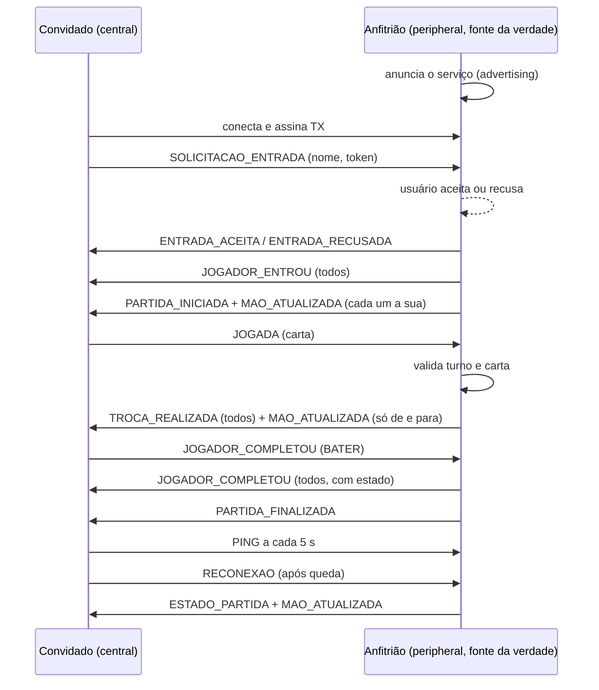

# Protocolo de mensagens e diagrama de comunicação

## Topologia
Estrela: o **anfitrião** é o único hub (GATT server / peripheral). Os **convidados** (central) se conectam só a ele. Nenhum convidado fala direto com outro.

- Serviço `6f2c1a10-8b3e-4d55-9c1a-b0a7e1c0de01`
  - **RX** `...de02` (WRITE): convidado → anfitrião
  - **TX** `...de03` (NOTIFY): anfitrião → todos os convidados inscritos



## Envelope
Toda mensagem é um JSON com:

| Campo | Descrição |
|---|---|
| `tipo` | um dos tipos abaixo |
| `partidaId` | id da partida (vazio antes de entrar) |
| `jogadorId` | quem enviou (exceção: em `JOGADOR_COMPLETOU` vindo do anfitrião é **quem completou**) |
| `seq` | contador crescente por remetente; mensagens repetidas ou antigas são descartadas |
| `token` | segredo do convidado, enviado em toda mensagem convidado → anfitrião |
| `destinatarioId` | opcional; só esse jogador processa a mensagem |

Exemplo do documento de requisitos (mais `seq`):
```json
{ "tipo": "JOGADA", "partidaId": "partida-01", "jogadorId": "jogador-01", "seq": 1,
  "carta": { "valor": "7", "naipe": "copas" } }
```

## Tipos
| Tipo | Sentido | Campos extras |
|---|---|---|
| `SOLICITACAO_ENTRADA` | C → A | `nome` |
| `ENTRADA_ACEITA` * | A → C | `estado` |
| `ENTRADA_RECUSADA` * | A → C | `motivo` |
| `JOGADOR_ENTROU` | A → todos | `estado` |
| `SAIDA` * | C → A | — |
| `JOGADOR_SAIU` * | A → todos | `estado` |
| `PARTIDA_INICIADA` | A → todos | `estado` |
| `MAO_ATUALIZADA` * | A → um jogador | `mao` |
| `JOGADA` | C → A | `carta` |
| `TROCA_REALIZADA` | A → todos | `de`, `para`, `estado` |
| `JOGADOR_COMPLETOU` | C → A e A → todos | `estado` (só do anfitrião) |
| `PARTIDA_FINALIZADA` | A → todos | `estado` |
| `JOGADOR_DESCONECTADO` | A → todos | `estado` |
| `RECONEXAO` | C → A | — |
| `ESTADO_PARTIDA` * | A → todos | `estado` |
| `ERRO` * | A → um jogador | `codigo`, `mensagem` |
| `PING` * | C → A | — |

\* Tipos adicionados além dos 9 do documento de requisitos ("tipos possíveis").

`estado` é o **estado público**: jogadores (nome, letras, conectado), vez, rodadas, fase e a **quantidade** de cartas de cada um. **Nunca contém as mãos.**

## Validação
1. Todo texto recebido passa por `interpretar()` (JSON + esquema zod). Inválido é descartado sem tocar no estado.
2. O anfitrião exige `jogadorId` conhecido e `token` correto e descarta `seq` repetido.
3. `validarJogada` / `validarBater` (domínio) checam fase, turno, carta e pausa. Falhas voltam como `ERRO`.

## Fragmentação
O BLE garante só 20 bytes por pacote. Cada mensagem vira pacotes `[tag][msgId][índice][total][até 16 bytes]`; `tag` é um byte aleatório do remetente (o anfitrião não sabe qual convidado escreveu, então isso evita misturar fragmentos). `Remontador` junta os pacotes (em qualquer ordem) e descarta incompletos após 10 s.
